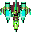
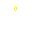
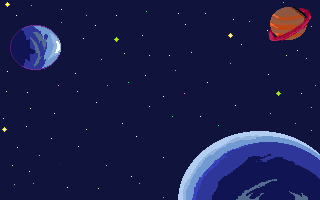

# Pygame

0. [Recursos](https://pygame.readthedocs.io/)
1. [Presentació](pygame.md)
2. [Dibuixar una finestra](dibuixar_finestra.md)
3. [Colors](color.md)
4. [Formes](formes.md)
   - [Activitats formes](activitats_formes.md)
   
5. [Formes transparents](transparencia.md)
6. [Imprimir Text](text.md)
    - [Activitat: Imprimir menú](activitat_menu.md)
7. [So](sound.md)
8. [Frames per second](fps.md)
9. [Moviment de la nau](moure_nau.md)
10. [Detecció de col·lisions](deteccio_colisions.md)
11. [Bales](bales.md)
12. [Vides](vides.md)

## Activitats puntuables:

- [Activitat puntuable 1: Concurs de creació de cares gracioses](concurs.md)
- [Activitat puntuable 2: Joc 1 versus 1](activitat3.md)
- Activitat puntuable 3:
   - [SMX-A Clon de Flappy Bird](activitat4.md)
   - [SMX-B Clon de Tetris](activitat5.md)

# Exemple menu inici:

```
import time

import pygame

AMPLADA = 320
ALTURA = 200
BACKGROUND_IMAGE = 'assets/fons.png'

pygame.init()
pantalla = pygame.display.set_mode((AMPLADA, ALTURA))
pygame.display.set_caption("Arcade")

def imprimir_pantalla_fons(image):
    # Imprimeixo imatge de fons:
    background = pygame.image.load(image).convert()
    pantalla.blit(background, (0, 0))
def animacio_inici():
    imprimir_pantalla_fons(BACKGROUND_IMAGE)
    pygame.display.update()
    # time.sleep(3)
    # FONT I TEXT de tamany 64
    font = pygame.font.SysFont(None, 52)
    for i in range(120):
        time.sleep(0.01)
        imprimir_pantalla_fons(BACKGROUND_IMAGE)
        img = font.render("Classic Invaders", True, (i+50, i+i, i))
        pantalla.blit(img, (20, 200-i))
        pygame.display.update()
    time.sleep(5)


def imprimir_menu():
    imprimir_pantalla_fons(BACKGROUND_IMAGE)
    # CREAR LA SUPERFÍCIE TRANSPARENT I EL RECTANGLE SOBRE ELLA:
    seccio_transparent = pygame.Surface((240, 120), pygame.SRCALPHA)
    pygame.draw.rect(seccio_transparent, (0, 0, 0, 100), (0, 0, 240, 120))
    # DIBUIXAR LA SUPERFÍCIE TRANSPARENT A LA FINESTRA
    pantalla.blit(seccio_transparent, (40, 40))
    # FONT I TEXT de tamany 64
    font = pygame.font.SysFont(None, 36)
    img = font.render("1.- Crèdits", True, (255, 255, 255))
    img2 = font.render("2.- Jugar", True, (255, 255, 255))
    img3 = font.render("3.- Sortir", True, (255, 255, 255))
    # dibuixem el text
    pantalla.blit(img, (70, 50))
    pantalla.blit(img2, (70, 90))
    pantalla.blit(img3, (70, 130))
    pygame.display.update()


def musica_fons(musica):
    ambient_music = pygame.mixer.Sound(musica)
    music_chanel = pygame.mixer.Channel(0)
    ambient_music.play()

musica_fons('assets/music.mp3')
animacio_inici()
imprimir_menu()

while True:
    pygame.display.update()
    for event in pygame.event.get():
        if event.type == pygame.QUIT:
            pygame.quit()

```

# Art del joc:

- [Web per dibuixar online - Pixilart](https://www.pixilart.com/)
- Per buscar imatges de naus per inspiració (sprite spaceship).

1. Nau protagonista (32x32 pixels fons transparent).
2. Tret de la nau (32x32 pixels fons transparent).
3. Pantalla presentació amb nom del joc i del developer (320x200 pixels).
4. Pantalla de fons (320x200 pixels).
5. Enemic (32x32)

# Exemple:

<br>
<br>
<br>
<br>

