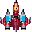

# Pygame

1. [Presentació](pygame.md)
2. [Dibuixar una finestra](dibuixar_finestra.md)
3. [Colors](color.md)
4. [Formes](formes.md)
   - [Activitats formes](activitats_formes.md)
   - [Activitat puntuable: Concurs de creació de cares gracioses](concurs.md)
5. [Formes transparents](transparencia.md)
6. [Imprimir Text](text.md)

# Art del joc:

- [Web per dibuixar online - Pixilart](https://www.pixilart.com/)
- Per buscar imatges de naus per inspiració (sprite spaceship).

1. Nau protagonista (32x32 pixels fons transparent).
2. Tret de la nau (32x32 pixels fons transparent).
3. Pantalla presentació amb nom del joc i del developer (320x200 pixels).
4. Pantalla de fons (320x200 pixels).
5. Enemic (32x32)

# Exemple:

 
 
 

